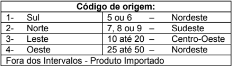

# Lista #01

Este repositório contém os exercícios de programação em JavaScript, da Formação Dev Full Stack Junior da [+prati](https://www.maisprati.com.br/) e [codifica](https://www.codificaedu.com.br/).

**Aluna:** [Andressa V Conrado](https://www.github.com/Andressavcon)

# Tarefas:

### [Exercício 1](./exercicios/exercicio1.js)

Escreva um algoritmo para ler uma temperatura em graus Celsius, calcular e escrever o valor correspondente em graus Fahrenheit.

**Exemplo**

```javascript
// Dados de entrada = 150 (temperatura em Celsius)
// Saída de dados = 302 (temperatura Fahrenheit)
```

### [Exercício 2](./exercicios/exercicio2.js)

Escreva um algoritmo para ler o número de eleitores de um município, o número de votos brancos, nulos e válidos. Calcular e escrever o percentual que cada um representa em relação ao total de eleitores.

**Exemplo**

```javascript
// Dados de entrada:
//      200 (quantidade de eleitores)
//      10 (quantidade de votos brancos)
//      20 (quantidade de votos nulos)
//      160 (quantidade de votos válidos)

// Saída de dados:
//      5 (porcentagem de votos brancos)
//      10 (porcentagem de votos nulos)
//      80 (porcentagem de votos válidos)
```

### [Exercício 3](./exercicios/exercicio3.js)

Faça um algoritmo que leia quatro números inteiros e realize as seguintes operações:

- Some 25 ao primeiro inteiro;
- Triplique o valor do segundo inteiro;
- Modifique o valor do terceiro inteiro para 12% do valor original;
- Armazene no quarto inteiro a soma dos valores originais (os que o usuário digitou) dos primeiros três inteiros

### [Exercício 4](./exercicios/exercicio4.js)

Escreva um algoritmo para ler as notas das duas avaliações de um aluno no semestre, calcular e escrever a média semestral e a seguinte mensagem: ‘PARABÉNS! Você foi aprovado’, somente se o aluno foi aprovado (considere 6.0 a nota mínima para aprovação).

### [Exercício 5](./exercicios/exercicio5.js)

Acrescente ao exercício acima a mensagem ‘Você foi REPROVADO! Estude mais’ caso a média calculada seja menor que 6,0

### [Exercício 6](./exercicios/exercicio6.js)

Ler três valores para os lados de um triângulo: A, B e C. Verificar se os lados fornecidos formam realmente um triângulo. Caso forme, deve ser indicado o tipo de triângulo: Isósceles, escaleno ou eqüilátero. Para verificar se os lados fornecidos formam triângulo: A < B + C e B < A + C e C < A + B

- Triângulo isósceles: possui dois lados iguais (A=B ou A=C ou B = C)
- Triângulo escaleno: possui todos os lados diferentes (A<>B e B <> C)
- Triângulo eqüilátero: possui todos os lados iguais (A=B e B=C)

### [Exercício 7](./exercicios/exercicio7.js)

As maçãs custam R$ 0,30 se forem compradas menos do que uma dúzia, e R$ 0,25 se forem compradas pelo menos doze. Escreva um algoritmo que leia o número de maçãs compradas, calcule e escreva o valor total da compra.

### [Exercício 8](./exercicios/exercicio8.js)

Escreva um algoritmo para ler 2 valores (considere que não serão lidos valores iguais) e escreve-los em ordem crescente.

### [Exercício 9](./exercicios/exercicio9.js)

Escreva um algoritmo que leia o código de origem de um produto e imprima a região do mesmo, conforme a tabela abaixo:



### [Exercício 10](./exercicios/exercicio10.js)

Escreva um algoritmo para ler um número inteiro e escrevê-lo na tela 10 vezes.

### [Exercício 11](./exercicios/exercicio11.js)

Escreva um algoritmo para ler uma quantidade indeterminada de valores inteiros. Para cada valor fornecido escrever uma mensagem que indica se cada valor fornecido é PAR ou ÍMPAR. O algoritmo será encerrado imediatamente após a leitura de um valor NULO ou NEGATIVO.

### [Exercício 12](./exercicios/exercicio12.js)

Escreva um algoritmo que gere os números de 1000 a 1999 e escreva aqueles que, divididos por 11, dão resto igual a 5.

### [Exercício 13](./exercicios/exercicio13.js)

Escrever um algoritmo que leia 5 valores para uma variável N e, para cada um deles, calcule e mostre a tabuada de 1 até N. Mostre a tabuada na forma:

- 1 x N = N
- 2 x N = 2N
- 3 x N = 3N

#### Utilizar somente while do exercício 14 ao 16

### [Exercício 14](./exercicios/exercicio14.js)

Fazer um algoritmo para receber números decimais até que o usuário digite 0 e fazer a média aritmética desses números.

### [Exercício 15](./exercicios/exercicio15.js)

Fazer um algoritmos para receber um número decimal e o peso de cada número até que o usuário digite o número 0. Fazer a média ponderada desses números e pesos respectivos.

### [Exercício 16](./exercicios/exercicio16.js)

Escreva um algoritmo para imprimir os 50 primeiros número primos maior que 100. Obs.: Número primo é aquele divisível somente por 1 e ele mesmo.
